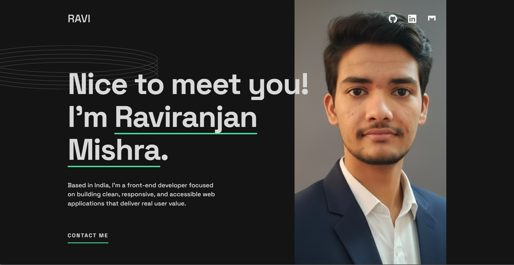

# 🚀 Ravi Mishra — Frontend Developer Portfolio

Welcome to my personal developer portfolio repository.
This project showcases my skills, projects, and experience as a **Frontend / MERN Stack Developer** with a strong focus on clean UI, performance, and modern web practices.

---

## 🌐 Live Demo

🔗 **Portfolio Live Link:** *https://raviranjanmishra01.github.io/Ravi-Portfolio/*  

---

## 📸 Screenshots

## 👨‍💻 About Me

I am a passionate frontend developer based in India, focused on building **responsive, accessible, and user-friendly web applications**. I enjoy working with modern JavaScript frameworks and continuously improving my development skills to industry standards.

---

## 🛠 Tech Stack

**Frontend:**
- HTML5
- CSS3

---

## 📬 Contact Me

- 📧 Email: raviranjanmishra768@gmail.com
- 🌍 GitHub: https://github.com/your-username
- Made with **Raviranjan mishra ❤️**

